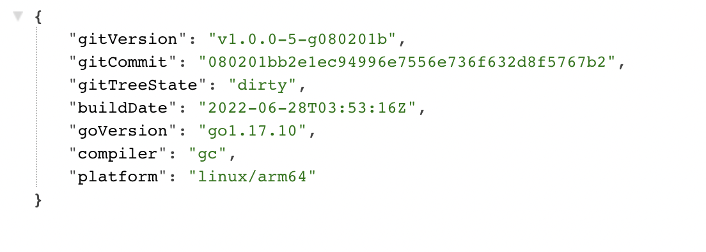
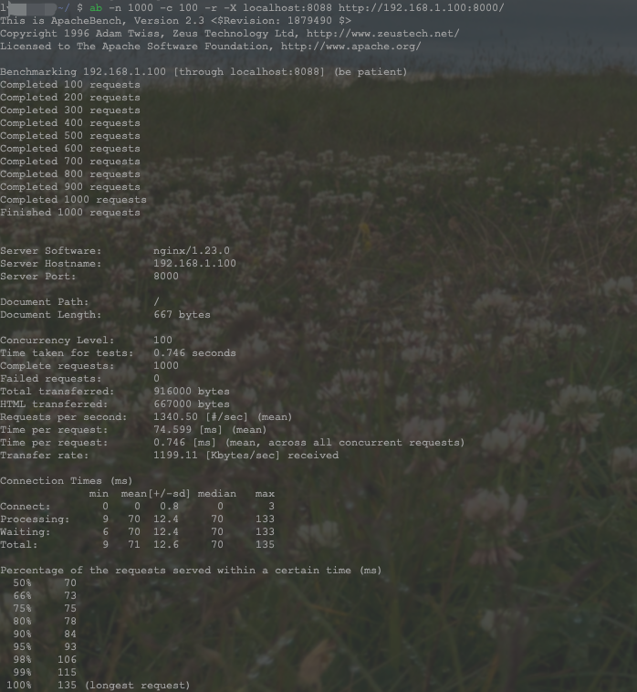

# PigPig - 分布式代理服务器

***PigPig*** 是受**anyproxy**的启发并且结合工作中所遇到的一些问题的解决方案，基于go语言开发的分布式代理服务器。
支持插件化的HTTP/HTTPS代理服务器，支持动态水平扩容。可供二次开发更灵活的处理请求逻辑，并且支持HTTPS的解析

代码架构 来源于极客时间专栏 **《[Go 语言项目开发实战](https://time.geekbang.org/column/intro/100079601?tab=intro)》**

***特此申明：*** 项目中很多基础代码都是通过该专栏习得，部分直接引用。

Github地址: https://github.com/notone0010/pigpig

# Docker image
```bash
docker pull notone0011/pigpig-arm64
```

## 安装

1. Docker/Docker-Compose
2. 源码安装

### Pre-requisite (Docker/Docker-Compose)

* Docker 18.03+
* Docker Compose 1.24+

### Pre-requisite (源码安装)

* Go 1.16+
* Redis 5.x+
* Etcd v3

# 快速开始

```bash
$ git clone https://github.com/notone0010/pigpig.git $GOPATH/src/github.com/notone0010/pigpig
$ cd $GOPATH/src/github.com/notone0010/pigpig
$ docker-compose up -d
```
命令执行完成后，可以访问 `http://localhost:8080/version` 查看当前服务版本信息



## 构建
1. git clone 
```bash
$ git clone https://github.com/notone0010/pigpig.git $GOPATH/src/github.com/notone0010/pigpig
```

2. 编译

```bash
$ cd $GOPATH/src/github.com/notone0010/pigpig
$ make
```

构建后的二进制文件保存在 `_output/platforms/linux/amd64/` 目录下。

3. 如需解析HTTPS

证书生成
```bash
$ make gen.ca
```
**浏览器若使用**please trust this CA

并在配置文件或者命令行指定证书地址

### 使用指南&&参数详解

[Documentation](docs)

### Benchmark


## TODO:
- [ ] plugins系统
- [x] PigPig 服务
- [ ] IP资源调度组件
- [ ] IP代理池
- [ ] flink实时分析


[comment]: <> (# ***未经授权不可商用***)