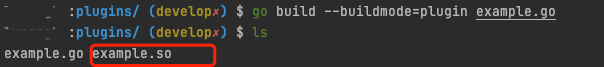

## 插件使用 示例

PigPig支持插件化的动态链接库加载

###示例代码
```go

package main

import (
	"log"

	"github.com/notone0010/pigpig/internal/pigpig/dudu"
	"github.com/notone0010/pigpig/internal/pkg/plugins"
)

type example struct{}

// NewPlugin function name is necessary NewPlugin
func NewPlugin() plugins.PigPigPlugins {
	return &example{}
}

var _ plugins.PigPigPlugins = (*example)(nil)

// ModifyRequest is an optional function that modifies the
// request before send to the remote.
func (e example) ModifyRequest(r *dudu.RequestDetail) {
	log.Printf("modify request")
}

// ModifyResponse is an optional function that modifies the
// Response from the remote. It is called if the remote
// returns a response at all, with any HTTP status code.
// If the backend is unreachable, the optional ErrorHandler is
// called without any call to ModifyResponse.
func (e example) ModifyResponse(r *dudu.RequestDetail, resp *dudu.ResponseDetail) {
	log.Println("modify response")
}

// ModifyError is an optional function if the remote is unreachable then call modify error
func (e example) ModifyError(c *dudu.RequestDetail, errors []error) {
}
```

func NewPlugin() plugins.PigPigPlugins 是必须的且名称固定

结构体中必须实现 plugins.PigPigPlugins 接口所规约的函数

```bash
# 创建你的插件包目录
$ mkdir your_plugin_package
# 进入目录
$ cd your_plugin_package
# touch example.go and edit it

# 编译你的主函数地址 parameter: --buildmode=plugin
# -o appoint your output file name
$ go build --buildmode=plugin example.go 
```

命令结束后将会在当前目录下生成example.so文件



启动时server.plugins配置参数中添加插件地址多个插件之间通过**,**隔开

***--server.plugins=plugin1.so,plugin2.so***